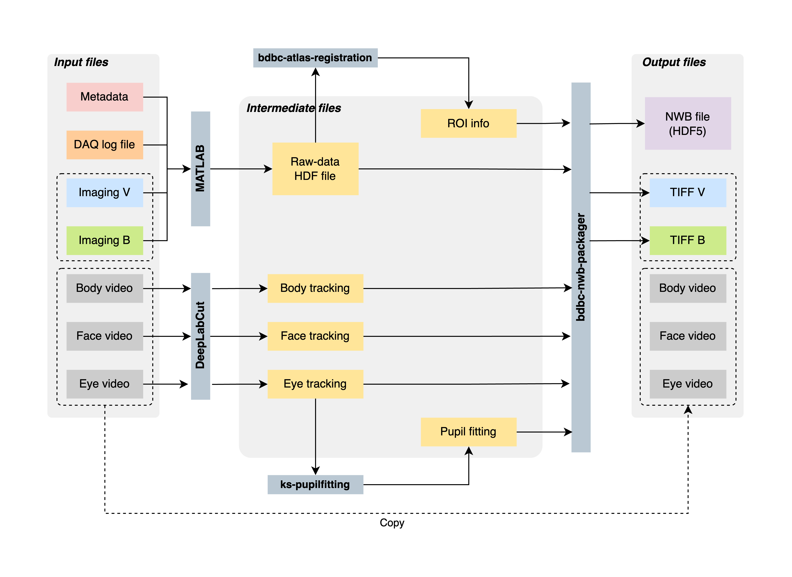

# Documentation

1. [Pipeline overview](#pipeline-overview)
   1. [Input files](#input-files)
   2. [Intermediate files](#intermediate-files)
   3. [Output files](#output-files)
2. [Packages available in `bdbc-data-pipeline`](#packages-available-in-bdbc-data-pipeline)
   1. [pipeline-core](#pipeline-core)
   2. [atlas-registration](#atlas-registration)
   3. [video-tracking](#video-tracking)
   4. [repository-browsing](#repository-browsing)
   5. [testing](#testing)
3. [How to use the installation script](#how-to-use-the-installation-script)

## Pipeline overview

Below is the overview of our pipeline.

> [!NOTE]
> 
> The implementation of MATLAB and DeepLabCut-based
> data conversion is not available in this repository.
>



### Input files

- **Metadata**: subject- and session-level information about the experiment.
- **DAQ log file**: the LVM file output of the recording from the National Instruments device.
- **Imaging V/B**: the DCIMG file output of the calcium imaging data, of violet (V) or blue (B) excitation channels.
- **Videos (body/face/eye)**: MP4 file output of behavior cameras, of upper-body (body), face or eye views.

### Intermediate files

_Before_ running code in `bdbc-data-pipeline`, the following procedures must have been done:

- **Raw-data HDF file**: imaging data is down-sampled and motion-corrected, and is merged with metadata and DAQ log, before being stored as an HDF file. MATLAB (2022b) is used to process the files.
- **DeepLabCut tracking files**: DeepLabCut (2.3.10) is used to track keypoints from behavior videos. The results are stored in corresponding HDF files.

The following steps are performed by running the packages in `bdbc-data-pipeline`:

- **ROI registration info**: [bdbc-atlas-registration](https://github.com/BraiDyn-BC/bdbc-atlas-registration) is used to align [Allen Common Coordinate Framework v3](https://alleninstitute.github.io/abc_atlas_access/notebooks/ccf_and_parcellation_annotation_tutorial.html) to the imaging data of the raw-data HDF file. The output is a "mesoscaler" HDF file, containing the alignment information and the ROI masks corresponding to individual neocortical areas.
- **Pupil fitting file**: [ks-pupilfitting](https://github.com/BraiDyn-BC/python-ks-pupilfitting) is used to fit an ellipse to pupil-edge keypoints of each eye video frame, and to store the fitted ellipse position and diameter in a "pupilfitting" HDF file. 

### Output files

All the [intermediate files](#intermediate-files) and behavior videos (if any of them exist) are used by [bdbc-nwb-packager](https://github.com/BraiDyn-BC/bdbc-nwb-packager) to generate a set of NWB output files.

- **NWB file**: the main output in the HDF5 format. It contains (i) DAQ log, (ii) ROI activity data, (iii) behavior tracking and pupil tracking data, as well as (iv) the reference links to the imaging data and behavior video files (see below).
- **Imaging TIFF files**: the original (but motion-corrected) imaging frames for both V and B channels are exported as TIFF files.
- **Behavior videos** (if any of them exist): directly copied from the original video files.


## Packages available in `bdbc-data-pipeline`

The packages in `bdbc-data-pipeline` are structured based on their purposes.

### `pipeline-core`

The minimal set of packages required for generation of NWB files (provided that all the intermediate files are available).

<<<<<<< HEAD
- [bdbc-session-explorer](https://github.com/BraiDyn-BC/bdbc-session-explorer): used to iterate over the sessions in the experiment when running [bdbc-nwb-packager](https://github.com/BraiDyn-BC/bdbc-nwb-packager).
- [bdbc-nwb-packager](https://github.com/BraiDyn-BC/bdbc-nwb-packager): the library that does all the job related to NWB file structure generation.
=======
- [bdbc-session-explorer](../pipeline-core/bdbc-session-explorer): used to iterate over the sessions in the experiment when running [bdbc-nwb-packager](../pipeline-core/bdbc-nwb-packager).
- [bdbc-nwb-packager](../pipeline-core/bdbc-nwb-packager): the library that does all the job related to NWB file structure generation.

<<<<<<< HEAD
The directory also contains the `env.template.sh` file, for more reproducible environment variable setting in UNIX-like environments.

> ![NOTE]
>
> Please refer to the [env.template.sh](../pipeline-core/env.template.sh) file to see how it works.
>
>>>>>>> 213e26a (add doc)

=======
>>>>>>> 05fe6cd (move env.template.sh to session-explorer)
### `atlas-registration`

A set of packages used for reference atlas registration.

<<<<<<< HEAD
- [bdbc-atlas-registration](https://github.com/BraiDyn-BC/bdbc-atlas-registration): works with [bdbc-session-explorer](https://github.com/BraiDyn-BC/bdbc-session-explorer) to batch-align the reference atlas to session-by-session imaging data.
- [ks-mesoscaler](https://github.com/BraiDyn-BC/python-ks-mesoscaler): used to align the reference atlas to individual images, and generate ROI masks (along with neocortical area ROIs).
- [ks-affine-aligner](https://github.com/BraiDyn-BC/python-ks-affine-aligner): used to align session images to generate animal-average images. These animal-average images are used to align the reference atlas using [ks-mesoscaler](https://github.com/BraiDyn-BC/python-ks-mesoscaler).
- [ks-affine2d](https://github.com/BraiDyn-BC/python-ks-affine2d): the common interface used by the other packages to estimate and apply affine transformation.
=======
- [bdbc-atlas-registration](../atlas-registration/bdbc-atlas-registration): works with [bdbc-session-explorer](../pipeline-core/bdbc-session-explorer) to batch-align the reference atlas to session-by-session imaging data.
- [ks-mesoscaler](../atlas-registration/ks-mesoscaler): used to align the reference atlas to individual images, and generate ROI masks (along with neocortical area ROIs).
- [ks-affine-aligner](../atlas-registration/ks-affine-aligner): used to align session images to generate animal-average images. These animal-average images are used to align the reference atlas using [ks-mesoscaler](../atlas-registration/ks-mesoscaler).
- [ks-affine2d](../atlas-registration/ks-affine2d/): the common interface used by the other packages to estimate and apply affine transformation.
>>>>>>> 213e26a (add doc)

### `video-tracking`

The package(s) related to behavior video tracking (only contains `ks-pupilfitting` at the time of writing).

<<<<<<< HEAD
- [ks-pupilfitting](https://github.com/BraiDyn-BC/python-ks-pupilfitting): a library that handles DeepLabCut output files and fits ellipses to pupil-edge keypoints.
=======
- [ks-pupilfitting](../video-tracking/ks-pupilfitting): a library that handles DeepLabCut output files and fits ellipses to pupil-edge keypoints.
>>>>>>> 213e26a (add doc)

### `repository-browsing`

The package(s) used to browse over the resulting NWB files (only contains `bdbc-nwb-explorer` at the time of writing).

<<<<<<< HEAD
- [bdbc-nwb-explorer](https://github.com/BraiDyn-BC/bdbc-nwb-explorer): a python-based tool for browsing the BraiDyn-BC NWB files.
=======
- [bdbc-nwb-explorer](../repository-browsing/bdbc-nwb-explorer): a python-based tool for browsing the BraiDyn-BC NWB files.
>>>>>>> 213e26a (add doc)

### `testing`

Sets of some _ad hoc_ scripts for testing the completeness of the code and the resulting NWB files.
They are stored for the purpose of logging what we have done, and should be considered as volatile and inconsistent.

<<<<<<< HEAD
- [bdbc-test-nwb-packaging](https://github.com/BraiDyn-BC/bdbc-test-nwb-packaging): used to test the integrity of the [bdbc-nwb-packager](https://github.com/BraiDyn-BC/bdbc-nwb-packager) code.
- [bdbc-batch-scripts](https://github.com/BraiDyn-BC/bdbc-batch-scripts): a set of batch scripts (may be in the form of Jupyter Notebooks) for sanity-checking of the output NWB files.


## How to use the installation script

The installation script (`install.py`) may be used to install the relevant packages,
by properly taking their dependencies into account.

>
> [!NOTE]
> For the script to run properly, it is important that **`install.py` should be**
> **at the top level of the `bdbc-data-pipeline` repository**, and all the
> package repositories should be properly located and populated (by running e.g.
> `git submodule init && git submodule update`).
> 
> Failing to do so may result in weird behavior of the script. 
>

For a brief summary of what can be done, run:

```shell
# use `python` or `python3` depending on how you install python
python install.py --help
```

In particular, we provide a functionality to install a subset of packages
depending on one's needs (which we call 'features'):

|Feature |Relevant directory |Functionality |
|--------|-------------------|--------------|
|`core`  |[pipeline-core](../pipeline-core/) |[NWB files generation](#pipeline-core) |
|`atlas` |[atlas-registration](../atlas-registration/) |[Registration to the reference atlas](#atlas-registration) |
|`video` |[video-tracking](../video-tracking/) |[Pupil tracking](#video-tracking) |
|`browse` |[repository-browsing](../repository-browsing/) |[Browsing the resulting NWB files](#repository-browsing) |
|`all` |All of the above |All of the above |

Thus, you can, for example, install only atlas registration-related packages
by running:

```shell
python install.py atlas
```

In addition, there is an option of the script to check what will be installed beforehand
(without running actual installation procedures):

```shell
# no installation process, only lists what will be installed
# by specifying 'atlas'
python install.py --no-install atlas
```

>
> [!NOTE]
> 
> In cases where you have specific requirements for installation of
> Tensorflow/DeepLabCut, we provide the `--no-external-deps` option so that
> the installation script does not attempt to install `deeplabcut[tf]`.
>
> In such cases, first install Tensorflow and DeepLabCut in your environment,
> and then run `install.py --no-external-deps` to install our packages.
>
=======
- [bdbc-test-nwb-packaging](../testing/bdbc-test-nwb-packaging): used to test the integrity of the [bdbc-nwb-packager](../pipeline-core/bdbc-nwb-packager) code.
- [bdbc-batch-scripts](../testing/bdbc-batch-scripts): a set of batch scripts (may be in the form of Jupyter Notebooks) for sanity-checking of the output NWB files.
>>>>>>> 213e26a (add doc)
